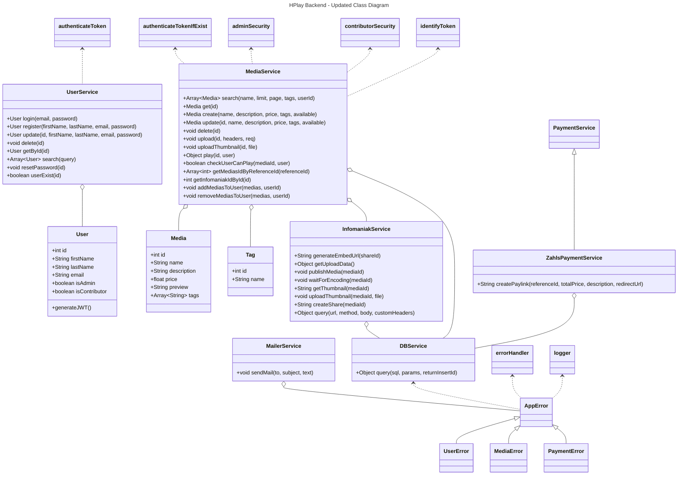

# Class Diagram

```mermaid
---
title: HPlay Backend - Updated Class Diagram
---

classDiagram
%% Models
    class Media {
        +int id
        +String name
        +String description
        +float price
        +String preview
        +Array~String~ tags
    }
    class User {
        +int id
        +String firstName
        +String lastName
        +String email
        +boolean isAdmin
        +boolean isContributor
        +generateJWT()
    }
    class Tag {
        +int id
        +String name
    }

%% Services
    class UserService {
        +User login(email, password)
        +User register(firstName, lastName, email, password)
        +User update(id, firstName, lastName, email, password)
        +void delete(id)
        +User getById(id)
        +Array~User~ search(query)
        +void resetPassword(id)
        +boolean userExist(id)
    }
    class MediaService {
        +Array~Media~ search(name, limit, page, tags, userId)
        +Media get(id)
        +Media create(name, description, price, tags, available)
        +Media update(id, name, description, price, tags, available)
        +void delete(id)
        +void upload(id, headers, req)
        +void uploadThumbnail(id, file)
        +Object play(id, user)
        +boolean checkUserCanPlay(mediaId, user)
        +Array~int~ getMediasIdByReferenceId(referenceId)
        +int getInfomaniakIdById(id)
        +void addMediasToUser(medias, userId)
        +void removeMediasToUser(medias, userId)
    }
    class InfomaniakService {
        +String generateEmbedUrl(shareId)
        +Object getUploadData()
        +void publishMedia(mediaId)
        +void waitForEncoding(mediaId)
        +String getThumbnail(mediaId)
        +void uploadThumbnail(mediaId, file)
        +String createShare(mediaId)
        +Object query(url, method, body, customHeaders)
    }
    class ZahlsPaymentService {
        +String createPaylink(referenceId, totalPrice, description, redirectUrl)
    }
    class MailerService {
        +void sendMail(to, subject, text)
    }
    class DBService {
        +Object query(sql, params, returnInsertId)
    }

%% Middlewares
    class authenticateToken
    class authenticateTokenIfExist
    class adminSecurity
    class contributorSecurity
    class identifyToken
    class errorHandler
    class logger

%% Errors
    class AppError
    class UserError
    class MediaError
    class PaymentError

%% Relations
    UserService o-- User
    MediaService o-- Media
    MediaService o-- Tag
    MediaService o-- InfomaniakService
    MediaService o-- DBService
    InfomaniakService o-- DBService
    ZahlsPaymentService o-- DBService
    MailerService o-- AppError
    DBService <.. AppError
%% Inheritance
    AppError <|-- UserError
    AppError <|-- MediaError
    AppError <|-- PaymentError
    PaymentService <|-- ZahlsPaymentService
%% Middlewares usage
    authenticateToken <.. UserService
    authenticateTokenIfExist <.. MediaService
    adminSecurity <.. MediaService
    contributorSecurity <.. MediaService
    identifyToken <.. MediaService
    errorHandler <.. AppError
    logger <.. AppError
```