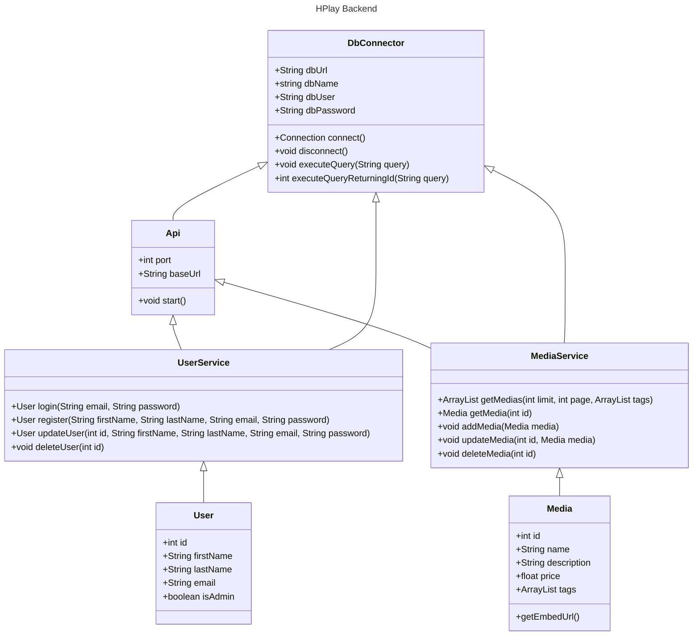

# Class Diagram

```mermaid
---
title: HPlay Backend
---

classDiagram
    class Media {
        +int id
        +String name
        +String description
        +float price
        +ArrayList<String> tags
        +getEmbedUrl()
    }
    
    class User {
        +int id
        +String firstName
        +String lastName
        +String email
        +boolean isAdmin
    }
    
    class UserService {
        +User login(String email, String password)
        +User register(String firstName, String lastName, String email, String password)
        +User updateUser(int id, String firstName, String lastName, String email, String password)
        +void deleteUser(int id)
    }
    
    class MediaService {
        +ArrayList<Media> getMedias(int limit, int page, ArrayList<String> tags)
        +Media getMedia(int id)
        +void addMedia(Media media)
        +void updateMedia(int id, Media media)
        +void deleteMedia(int id)
    }
    
    class Api {
        +int port
        +String baseUrl
        +void start()
    }

    class DbConnector {
        +String dbUrl
        +string dbName
        +String dbUser
        +String dbPassword
        +Connection connect()
        +void disconnect()
        +void executeQuery(String query)
        +int executeQueryReturningId(String query)
    }
    
    Api <|-- UserService
    Api <|-- MediaService
    UserService <|-- User
    MediaService <|-- Media
    DbConnector <|-- Api
    DbConnector <|-- UserService
    DbConnector <|-- MediaService
```